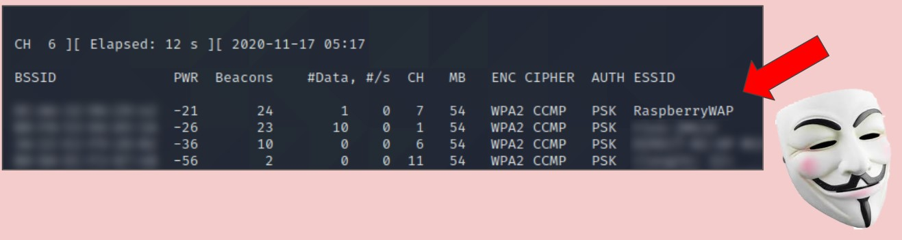
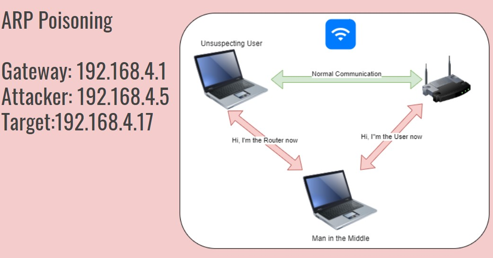
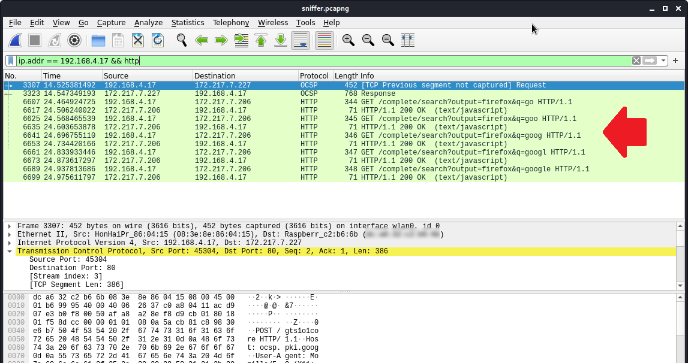
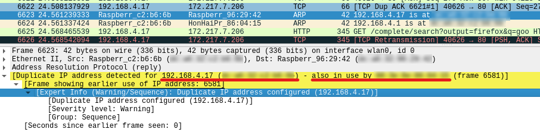

# pihack_the_wap
## Whitehat Hacking a WAP with Kali Linux and Raspberry PI
This article is to demonstrate how to ethically hack a Wireless Access Point with Kali Linux by using low cost and extremely portable Raspberry Pis to introduce possible ways to attack WAPs and better mitigate them.

***disclaimer**: This article is a reproduction of an Industry Demostration Day. Do not try the methods explained in this article on any network you do not have strict permission to do so. You have been warned.*

With the current pandemic causing more employees working remotely, crucial information is being transmitted over these more insecure network connections. Secure and Safe Practices are needed now more than ever to keep hackers and malicious activity at bay. Let’s take a look at the tools that can be used by these threat actors.

# The Tools

1. Raspberry Pi 3 running Raspberry Pi OS (debian) acting as the insecure Wireless Access Point and Router. 

2. Raspberry Pi 4 with KALI Linux OS and it’s new internal network card set to monitor mode for wifi monitoring. Older PIs require bulky external usb wifi monitors making the Pi 4 a stealthier choice. There are also many accessories that can make the small Pi even more inconspicuous and stealthy, such as wireless mini controllers and portable Monitors.

3. A Repurposed Laptop with Linux MINT to be the unsuspecting network user. 

## THREAT ASSESSMENT & ATTACKS
There are many but we’ll look at these three
- We’ll try Brute Force Attacks trying to gain access to network.

- With network access we’ll use MitM ATTACKS by using ARP Poisoning.

- If all else fails, we can physically install a FAKE WAP, creating our own unauthorized access point.

### Brute Force Attacks
1. To start we need to put the Kali PI into wireless monitor mode to allow us to grab WPA handshakes and the like. These commands will initialize the internal card on the Raspberry Pi.

    - Monitor Mode
    ```
    ~# iw phy `iw dev wlan0 info | gawk '/wiphy/ {printf "phy" $2}'` interface add mon0 type monitor
    ~# ifconfig mon0 up
    ~# ifconfig
    ```
2. Search for Nearby Networks
    - To Search for nearby networks, we will use airodump-ng and select our interface to search nearby networks. Here we find our PiWAP.
        - Due to the low power nature of the Raspberry Pi's internal card, we have a short search radius but this will be fine for our home lab.
    ```
    ~airodump-ng mon0
    ```
    Here we find our tool 1. = Raspberry PI WAP:

    

    - For an additional check for vulnerability we can use the aireplay-ng command to test for packet injection availability, but this time, we get no results. Let’s look at our some other options.

    ```
    ~# aireplay-ng -b <MAC-RaspberryWAP> --test mon0
    ```
    - Now that we have sniffed out our WAP, there are many methods that can be used to brute force attacks assuming the WAP is locked down and free to the public.
        - Some examples: Capturing handshakes, Hashcat attacks using PMKID, and Guessing default passwords - one of the the fastest ways to brute force.
        
            For speed and time, we are going to guess that the default password of “adminadmin” has not been changed, granting us access to the network.

### Man in the Middle (MitM) Attack
  
1. ARP Poisoning
- Now that we have access, we’ll perform our man in the middle attack using ARP Poisoning (Address Resolution Protocol) to intercept the traffic between the target user and the WAP with the IPs we gathered earlier for this excercise. This will place ourselves in between the router and target, forwarding packets to their respectful destinations. All the while sniffing the packets as they venture through.

     

- After having our lab up and running, we can start the ARP poisoning Attack using arpspoof. We run our commands to spoof the MAC address of the client for the host and of the host for the client. Covering both directions of traffic.
     SYNTAX: ~# arpspoof -i (interface) -t (target-ip) -r (host-ip)
    - Open 3 terminal windows but wait to press enter once all three are ready
         In first window enter.
        
         ```
            ~# arpspoof -i wlan0 -t 192.168.4.17 -r 192.168.4.1
         ```
    - In second window you will need to reverse the direction.
         ```
         ~# arpspoof -i wlan0 -t 192.168.4.1 -r 192.168.4.17
         ```        
    - Once we have successfully started to impersonate the target and router, we want to make sure we can pass forward all of those packets using ip_forward. This command directly echoes a  “true” value into ip_forward, turning it on. Type this in the third terminal window.    
         ```
         ~# echo 1 > /proc/sys/net/ipv4/ip_forward
         ```
    - Press Enter on your first 2 windows starting your MAC address spoof with arpspoof, then enter your echo command in your 3rd window to start your ip forwarding.

2. Wireshark
     - Now that we are in the middle, we’ll take some time to sniff the packets using the program, Wireshark and save them to a capture file. Filtering out our target’s IP address of 192.168.4.17 and http protocol, we can see where the target typed “google” in the firefox search bar.

     

     - This is an example of how an attacker can sniff through clear text to gain info or even worse, grab credentials that were entered through clear text. Using https and other types of encryption such as the use of VPNs are beneficial.
    
- We can see in Wireshark the arp spoofing attack was successful by the duplicate addresses for the two different MAC addresses.

        
   
   If we can see this, so can anyone monitoring the network for such attacks with an Intrusion Detection System or even Wireshark. When a threat actor uses a MitM attack, they can gain credentials, alter communications, spy on individuals, corporations or even nation states with many possible goals in mind. Again, encryption is the main deterrent for these attacks.
   ### Rogue Acess Points

   1. Fake Wireless Access Point
    
        Finally, If a threat attacker doesn’t want to go through the trouble of trying to penetrate the existing WAP, or there just isn’t one present, they could use the PI as a FAKE WAP. A hacker can insert this into any local network and provide an apparent innocent access point to take advantage of any unsuspecting users.

## Mitigation for a Vulnerable WAP

### Policies, Employee Training and Safe Practices.

It’s of high importance that policies are updated and emloyees are consistantly trained. Also, we can ...
1. Create company wide policies regarding the usage of wireless devices.
2. Provide and require employees to use more secure company devices instead of personal.
3. Monitor the devices and network to make sure employees are in compliance.

### Access Restrictions

1. Make sure to have available security enabled.
2. Have Employees use monitored Encrypted Virtual Private Network, especially at home.
3. Use static IP addresses over Dynamic Host Configuration Protocol. Disable DHCP as to not automatically assign IP addresses.
4. Change default Set Service Identifier (SSID) to a more complex naming convention. To further harden, use a closed network by changing the SSID often. This will require entering the SSID by the client.
### Rogue WAPs

With Rogue WAPs, possible bullet points are...
1. Network monitoring to watch for unauthorized access points.
2. Disable community Simple Network Management Protocol on access points.
3. Incorporate longer time intervals for re authentication for all users.

### Malicious Attacks: MAC Spoofing, and Session Hijacking

1. Install and Intrusion Detection System (IDS) and review logs at regular intervals.
2. Use and maintain updated antivirus software.
3. Create backups and scheduled restorations.
4. Even though MAC addresses can be spoofed, using a Firewall to restrict access of MAC addresses can still greatly increase security.
5. Monitor and scan critical host logs at a higher frequency.

### Home Network Router Hardening

For those users working remotely, here are some ways to help protect yourself and data.
1. Change the default router passwords to more secure and complex ones. The default passwords from most vendors have been leaked and can easily be brute forced with a wordlist.
2. Disable Wifi Protected Setup (WPS) and Universal Plug and Play (UPnP). These two features are efficient yet weak.
3. Enable guest network and keep all important networking hidden and separate from Internet of Things, speakers, lighting control, and guest access.
4. Keep firmware up to date if possible.
5. Again, practice good security practices, use VPNs, use https.
6. Use more complex passwords, do not store passwords in web browsers. Use a reputable password encryption manager if needed.

## Conclusion

Due to the high risk of Wireless Access Points (WAPs), with higher frequency of log monitoring, the consistent education employees, and implementing updated security policies can help remain compliance and maintain a more secure network. Out of all the securities and policies, the use of VPNs can not be stressed enough. Especially, since the tools used in this presentation are easily acquired and can access wifi traffic and the data it contains. 

I will be continuing to get into more depth and analysis with both the offensive and defensive sides of this project.

## Resources

Hacking WPA2 by Capturing Handshakes
https://www.kalitutorials.net/2014/06/hack-wpa-2-psk-capturing-handshake.html

HASHCAT Attack
https://null-byte.wonderhowto.com/how-to/hack-wi-fi-cracking-wpa2-passwords-using-new-pmkid-hashcat-attack-0189379/

PIRouter WAP
https://www.raspberrypi.org/documentation/configuration/wireless/access-point-routed.md

Raspberry Pi 4 miniature hacking box
https://null-byte.wonderhowto.com/how-to/load-kali-linux-raspberry-pi-4-for-ultimate-miniature-hacking-station-0201737/

Kali Linux Raspberry Pi 4 Documentation
https://www.kali.org/docs/arm/kali-linux-raspberry-pi/

Man in the Middle attack with Kali Linux
https://ourcodeworld.com/articles/read/422/how-to-perform-a-man-in-the-middle-mitm-attack-with-kali-linux

https://www.csoonline.com/article/3340117/what-is-a-man-in-the-middle-attack-how-mitm-attacks-work-and-how-to-prevent-them.html


